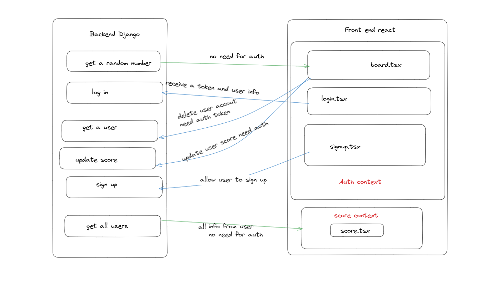
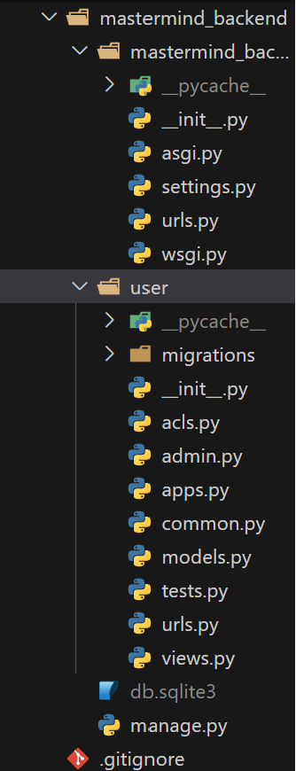
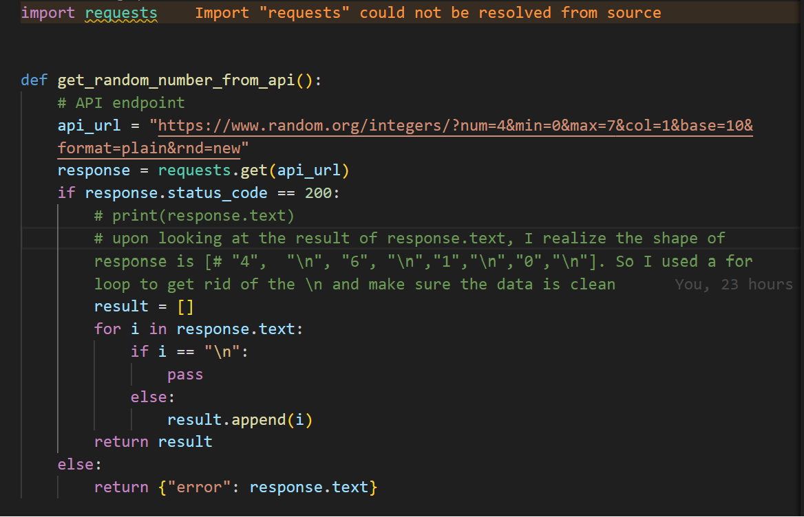
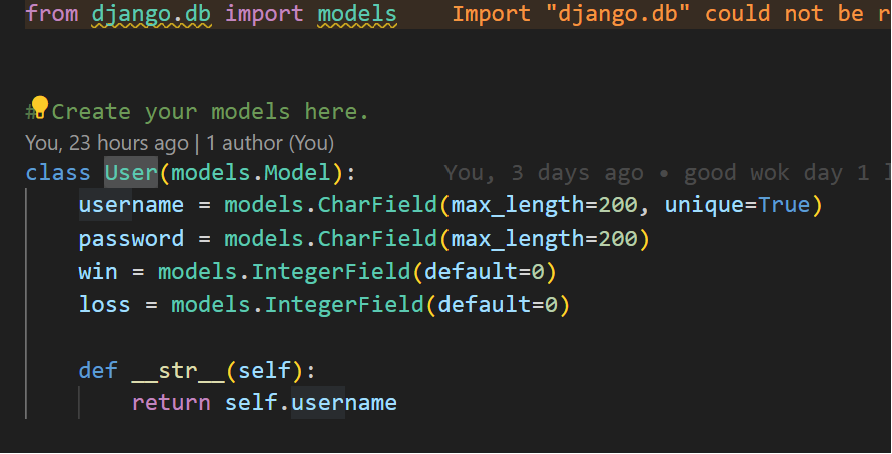
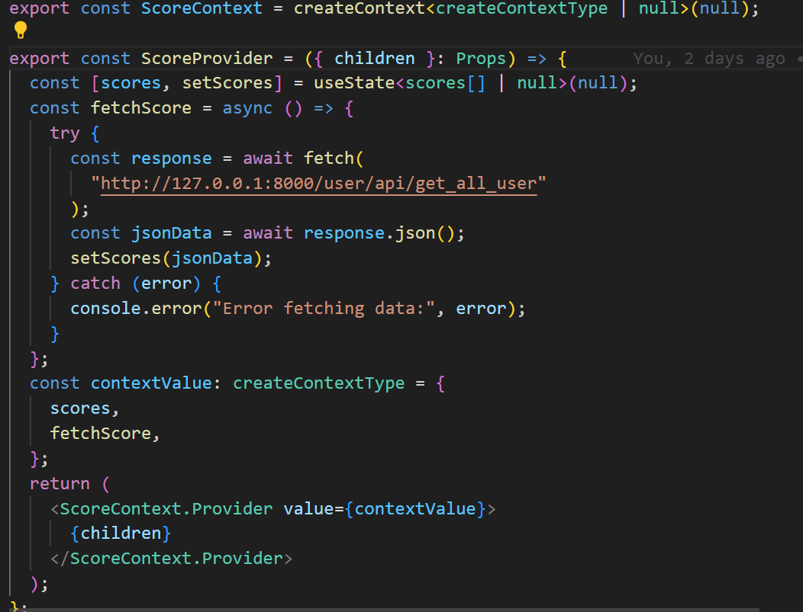
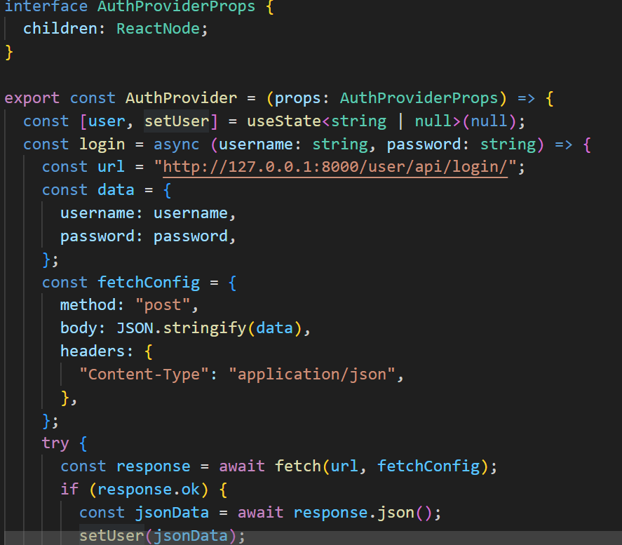
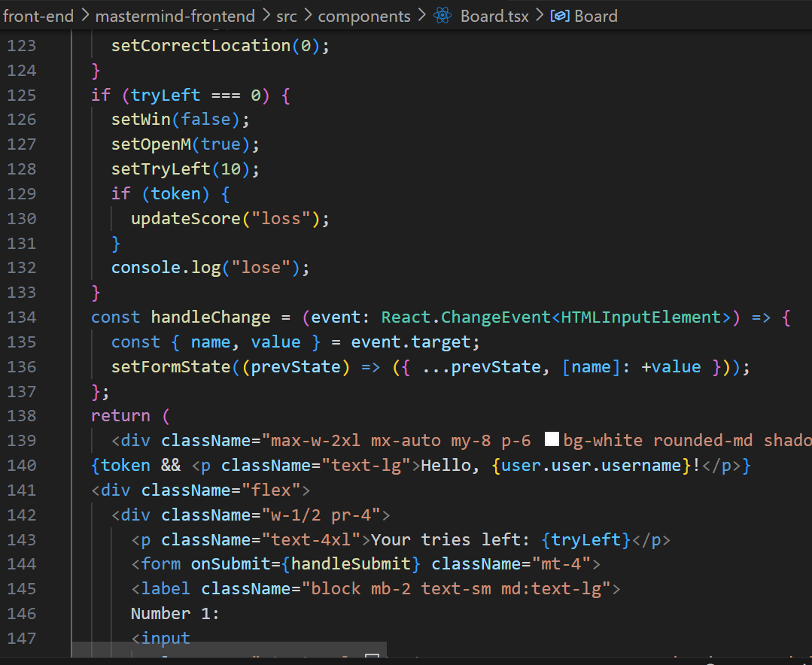
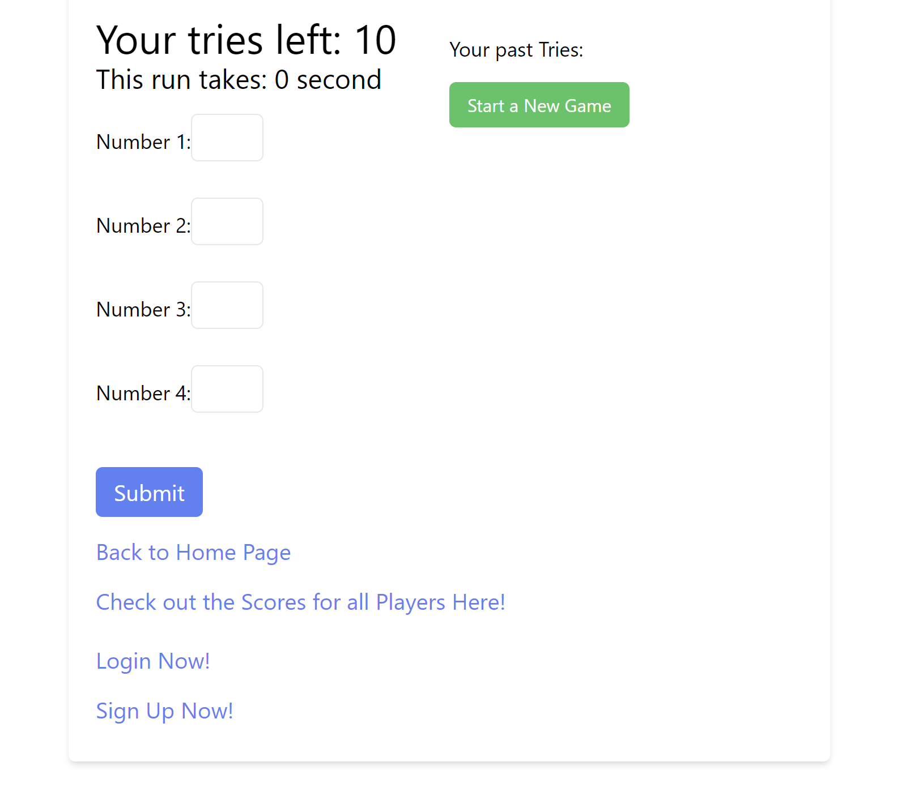
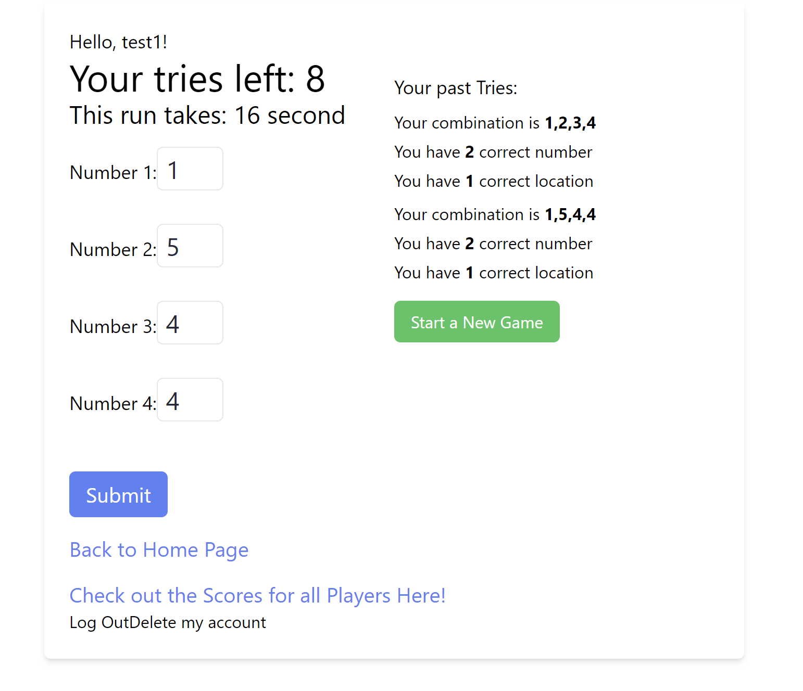

# MasterMind 
A take home challenge for REACH Program. 

# Table of Content
- [Project Description](#project-description)
- [Running the Project](#Running-the-Project)
- [Testing](#Testing)
- [Game Rule](#Game-Rule)
- [Tech Stack](#Tech-Stack)
- [Creative Extensions](#Creative-Extensions)
- [System Design](#System-Design)
- [Code Structure](#Code-Structure)
- [API Endpoint](#API-Endpoint)
- [Further Improvement](#Further-Improvement)
s

# Project description
This is a game where a player tries to guess the number combinations. A player must guess the right number combinations within 10 attempts, and within 300 seconds to win the game. At the end of each attempt to guess the 4 number combinations, the computer will provide feedback whether the player had guess a number correctly, or/and a number and digit correctly.  Player can sign up, log in, and have their score recorded. Player have the ability to check all users' scores, and play without signing up. 

# Running the Project
 * Clone/pull the Project
 * run ```cd mastermind```
 * run ```cd back-end```
 * create/active your Python Virtual Environment for your OS 
 * run ```pip install -r requirement.txt``` for the dependency 
 * ```cd mastermind_backend```
 * run ```python manage.py migrate ``` to migrate all the setting for django
 * run ```python manage.py runserver ``` to start django server for both the sqlite and backend AIP endpoint
 * open a new terminal 
 * cd into the most outer layer of the project 
 * ```cd front-end```
 * ```cd mastermind-frontend```
 * run ``` npm install``` for the dependency
 * run ```npm run dev ``` for front-end UI 
 * backend runs on localhost 8000, frontend runs on localhost 5173
 * App was tested on Chrome 
 

# Testing
In mastermind\back-end\mastermind_backend, run ```python manage.py test``` to unit test the endpoint. There are 9 tests that test situation where input is correct as well when input is not. The test.py file have 9 test for 6 endpoints. There is no test for front-end yet. 

# Game Rule 
At the start of the game the program will randomly select a pattern of four different numbers from a total of 8 different numbers, from 0 to 7! A player will have to guess the right combination with in 10 attempts and within 300 seconds. At the end of each guess, We will provide some feedbacks for your guess. Try to guess the correct combinations before the attempts runs out. 

# Tech Stack
Web-development is the most familiar form of Software development to me. Therefore, I decided to make a web-based game for this challenge.<br />
Although there are many different language to choose from for web backend development, the one I am most confident about is Python. <br />
After deciding the language, I need to choose a framework. There are two main python framework to choose from, Flask or Django. I chose Django because the built-in database, testing framework, Django admin and the entire ecosystem around the framework that make the development experience much smoother.<br />
The front-end framework is the industry-standard, React. For the CSS, I employed tailwind CSS for simplicity and clarity.  
I also chose TypeScript for its strict typing system to ensure code quality, so no any.

# Creative Extensions
* Allow user to create account and log in. 
* Created backend authentication that check for username, and password. 
* Protect sensitive endpoint with JWT based token authentication. 
* Allow users to keep track of their record.
* Wrote unit tests that test the endpoint.
* Added a timer for the front-end view.


# System Design 
An overview for each components in the application, and a drawing for how they communicate with each other. 
## Components
1. Frontend(Client-browser)
* The user interacts with the game through the browser.
* The frontend is responsible for rendering the game interface and handling user input.
2. Backend(Server)
* The backend handles getting the number, stores user data, and communicates with the database.
* Handle user user authentication and authorization with JWT 
3. Database(sqlite)
* Store user data, such as username, password, win and lose amount


## Diagram 

* This is the drawing for how backend communicate with the front-end. 
# Code Structure

* This is the first layer into the project, I divided into two separate folder, one for front-end and one for backend. 


* In the back-end folder, we have our basic python setup for git, and the mastermind_backend folder that contains the django project. Inside the project, we have the mastermind_backend folder for django setting, the built in sqlite database, and the user app for majority of the logic. 


* Inside the front-end structure, we have the basic setup for react with TypeScript. In side the src folder, we have our app. In the assets folder, we have our contexts provider for the app. And we have the rest of the app in the components folders for each page. 


## Important File Purpose-Backend


* The acl.py file contains a function for calling the Random generator API. We use a different function to call the 3rd party API. So the user will ot be able to call the API directly. 


* The model.py file is where we store our model for our database table. Each table would have id(generated by default), username, password, win and loss. Note, very important, the user model is from Models.model class, rather than the django build-in authentication models.

## Important File Purpose-Frontend

* This is the score context where we fetch for all the score, and pass the function that fetch the score out. This way, when ever we need to update the score, we can use the function with doing too much props grillings.


* This is the auth context where we fetch for user information once logged in. Image is too small for all the code. We are passing user, setUser, login, and logout to all of our components. In user, we have an object that store the username, win, lose, and the access token for the user. setUser is the setter function we have from useState. Login is the function we call to receive user info. We store the user information with setUser setter function. Very important, we are not storing the user JWT token in cookie or local storage. I choose to only use react state to store, therefore, once user refresh the page, the state will be lost and the user is logged out. 


* This is the most important component in the front-end. Not only it has all the game logic, it also has all the user update logic. 


* Once user click start a new game, we will call the backend to return us a new random number. And the game now start. Every time the user guess a number, the tries will go down, as shown in the 2nd picture, and the past guess and feed back will appear on the right side. Assuming the user is logged in, we will send an PUT api call to the backend updating weather the user win the game or not, then call the fetchScore from score context and update the score.tsx components. When user is not logged in, It also give link for user to login, or sign up. Once the game finish, the result will pop up, and user can start a new game. As soon as the game start, we will have a timer to keep track of the amount of the time user used to play the game. Once the timer hit 300 the user will also receive the loss result. 

# API Endpoint
Both url.py and view.py together achieve our routing need for API endpoint. We are using RESTful API. We have a total of 6 endpoint. 
They are: 
1. get_random_number for getting a random number
2. log_in for logging in a user
3. signup for create user
4. api_get_user for getting a user or deleting a user
5. api_get_all_user for get all the user
6. api_score for updating the score

## get_random_number 
``` python
@api_view(["GET"])
def get_random_number(request):
    response = get_random_number_from_api()
    res = JsonResponse(response, safe=False)
    return res
# this is the url for this end point
# url = /user/api/get_random_numbers
```
This is the endpoint for getting a random number. we simply call the function that calls the 3rd party api, and we send the response as json to the front-end

## log in 
```python 
@require_http_methods(["POST"])
def log_in(request):
    try:
        content = json.loads(request.body)
    except json.JSONDecodeError:
        return 400, {"message": "Bad JSON"}, None
    username = content["username"]
    password = content["password"]
    try:
        user = User.objects.get(username=username)
    except User.DoesNotExist:
        response = JsonResponse({"message": "does not have this username"}, status=404)
        return response
    check_pass = user.password
    password_check = check_password(password, check_pass)
    if password_check:
        refresh = RefreshToken.for_user(user)
        token = {
            "refresh": str(refresh),
            "access": str(refresh.access_token),
        }
        data = {"token": token, "user": user}
        return JsonResponse(data, UserListEncoder, status=200)
    else:
        response = JsonResponse({"message": "wrong password"}, status=403)
        return response
# this is the url for this end point
# url = /user/api/login/
```
* The log_in API is designed for user authentication. It accepts HTTP POST requests with JSON-encoded data containing the user's username and password. The API validates the provided credentials, and upon successful authentication, it generates JWT (JSON Web Token) access and refresh tokens. These tokens can be used for secure access to authenticated endpoints. If the provided credentials are incorrect, the API returns appropriate error messages. During development I run into some bug for this endpoint because I choose not to use the built in User model from Django. The difference between django and django rest also proves some difficulty during development, but I figured out later. 
## Sign Up
```python 
@api_view(["POST"])
def signup(request):
    try:
        content = json.loads(request.body)
    except json.JSONDecodeError:
        return 400, {"message": "Bad JSON"}, None
    username = content["username"]
    user = User.objects.filter(username=username)
    if user:
        return JsonResponse({"message": "user already exist"}, status=400)
    try:
        content["password"] = make_password(content["password"])
        account = User.objects.create(**content)
        return log_in(request)
    except ValueError as e:
        return 400, {"message": str(e)}, None
# this is the url for this end point     
# url = /user/api/user/signup/
```
* The sign up API is designed for user sign up. It accepts HTTP POST requests with JSON-encoded data containing the desired username and password. The API validates the provided data, ensuring it is well-formed JSON. If successful, it checks if the specified username is already in use. If the username is available, the API securely hashes the password using Django's make_password function, creates a new user account, and initiates user authentication by calling the log_in API. And we would log the user in as soon as they create te account. If the provided JSON is invalid or if the username is already taken, appropriate error responses are returned. During development, I tried to take account of all the error the endpoint might have, and I did some documentation searching the ```make_password``` function and make sure the safety of the user password. 

## JSON encoder used in function 
```python 
class UserListEncoder(ModelEncoder):
    model = User
    properties = ["username", "win", "loss"]

class UserEncoder(ModelEncoder):
    model = User
    properties = ["username"]
```
* These two encoder help us to change JSON bytes into JSON objects we can use in backend. 

## Get/Delete User 
```python
@api_view(["GET", "DELETE"])
@permission_classes([IsAuthenticated])
def api_get_user(request, username):
    try:
        user = User.objects.get(username=username)
    except User.DoesNotExist:
        response = JsonResponse({"message": "does not have this user"})
        response.status_code = 404
        return response
    if request.method == "GET":
        return JsonResponse(
            user,
            UserListEncoder,
            safe=False,
        )
    else:
        count, _ = User.objects.filter(username=username).delete()
        return JsonResponse({"deleted": count > 0})
# this is the url for this end point     
# url = /user/api/get_user/{username to pass in}/
```
* The api_get_user API endpoint allows authenticated users to retrieve information about a specific user or delete their own account. This endpoint supports both GET and DELETE HTTP methods.If the user exists, the API responds with a JSON representation of the user's information, will return deleted true for deleted. 
In case the user does not exist, a 404 status with an appropriate error message is returned. During development, I ran into a huge problem with ```@permission_classes([IsAuthenticated])```. In Django rest simple jwt, it requires developer to use the built in User model from ```django.contrib.auth.Models```. I choose to use the Models.model instead. Which cause the authentication to bug for a while. In the end, I fix the bug by going to the code from the library, and discover that I need stateless auth, where a user is not needed for ```@permission_classes([IsAuthenticated])```.

## Get all User 
```python 
@api_view(["GET"])
def api_get_all_user(request):
    try:
        users = User.objects.all()
        response = JsonResponse(users, UserListEncoder, safe=False)
        return response
    except:
        return JsonResponse(
            {"message": "something went wrong"},
            status=400,
        )
# this is the url for this end point     
# url = /user/api/get_all_user
```
* The api_get_all_user API endpoint allows users to retrieve information about all users in the system, including their win, loss and username. This endpoint supports the GET HTTP method. This endpoint is mainly for checking all the score from all user. This does not need auth as I want the user that did not sign up also be able to view other player's achievement.


```python 
@api_view(["PUT"])
@permission_classes([IsAuthenticated])
def api_score(request, username):
    try:
        user = User.objects.get(username=username)
    except User.DoesNotExist:
        response = JsonResponse({"message": "does not have this user"})
        response.status_code = 404
        return response
    content = json.loads(request.body)
    if "result" in content:
        User.objects.get(username=username)
        if content["result"] == "win":
            user.win += 1
            user.save()
        elif content["result"] == "loss":
            user.loss += 1
            user.save()
        else:
            response = JsonResponse({"message": "BAD JSON"})
            response.status_code = 400
            return response
        return JsonResponse(user, UserListEncoder, safe=False)
    else:
        response = JsonResponse({"message": "BAD JSON"})
        response.status_code = 400
        return response
# this is the url for this end point     
# url = /user/api/score/test5/
```
* The api_score API endpoint allows authenticated users to update their game scores. This endpoint supports the PUT HTTP method. Depend on the JSON we will determined if the user win or loss. And we will query the database and update the according field. We will make sure that we return a 400 for bad json. During development, I run into the problem of updating the field. So upon reading the documentation, I choose to use ```user.save()``` to update the field. 


# Further Improvement
* Add difficulty for the amount of number we receive 
* Use docker for the app, achieve easier scaling 
* Add user token to local storage for better user experience 
* Add refresh token, and blacklist token ability for backend 
* Deployment 
