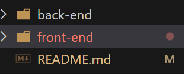

# MasterMind 
A take home challenge for REACH Program. 

<!-- # todo for next time: remember to setup timer? or diffculity for the game  -->

# Table of Content
- [Project Description](#project-description)
- [Running the Project](#Running-the-Project)
- [Game Rule](#Game-Rule)
- [Tech Stack](#Tech-Stack)
- [Code Structure](#Code-Structure)

# Project description
This is a game where a player tries to guess the number combinations. At the end of each
attempt to guess the 4 number combinations, the computer will provide feedback whether the
player had guess a number correctly, or/and a number and digit correctly. A player must guess the right number combinations within 10 attempts to win the game. Player can sign up, log in, and have their score be recorded. Player have the ability to check all user'score, and play without signing up. 

# Running the Project
 * Clone/pull the Project
 * run ```cd back-end```
 * create/active your Python Virtual Environment for your OS 
 * run ```pip install requirement.txt``` for the dependency 
 * ```cd mastermind_backend```
 * run ```python manage.py runserver ``` to start django server for both the sqlite and backend AIP endpoint
 * cd into the most outer layer of the project 
 * ``` cd front-end```
 * run ``` npm install``` for the dependency
 * run ```npm run dev ``` for front-end UI 
 * backend runs on localhost 8000, frontend runs on localhost 5173
 * App was tested on Chrome 
 
# Game Rule 
At the start of the game the We will randomly select a pattern of four different numbers from a total of 8 different numbers, from 0 to 7! A player will have 10 attempts to guess the number combinations. At the end of each guess, We will provide some feedback for your guess. Try to guess the correct combinations before the attempts runs out. 

# Tech Stack
Web-development is the most familiar form of Software development for me . Therefore, I decided to make a web-based game for this challenge. Although there are many different language to choose from for web backend development, the one I am most confident about is Python. After deciding the language, I need to choose a framework. There are two main python framework to choose from, Flask or Django. I personally like to use Django more because of the built in database, testing framework, Django admin and the entire ecosystem around the framework would make the development experience much smoother.
For the front-end, I choose the go to framework for many different web today, React. For the CSS, I choose to use tailwind CSS, as I believe its the easiest css tool to use. Although there are a lot of extra library to use with React, I choose not to use any external library for the front-end, to make sure I have full control of my code. 

# Code Structure

