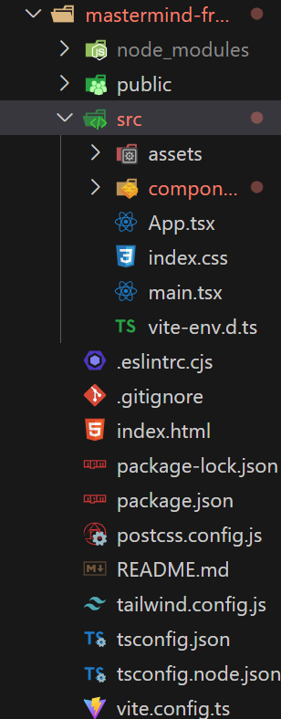

# MasterMind 
A take home challenge for REACH Program. 

<!-- # todo for next time: remember to setup timer? or diffculity for the game  -->

# Table of Content
- [Project Description](#project-description)
- [Running the Project](#Running-the-Project)
- [Game Rule](#Game-Rule)
- [Tech Stack](#Tech-Stack)
- [Creative Extensions](#Creative-Extensions)
- [System Design](#System-Design)
- [Code Structure](#Code-Structure)
- [API Endpoint](#API-Endpoint)


# Project description
This is a game where a player tries to guess the number combinations. At the end of each
attempt to guess the 4 number combinations, the computer will provide feedback whether the
player had guess a number correctly, or/and a number and digit correctly. A player must guess the right number combinations within 10 attempts to win the game. Player can sign up, log in, and have their score be recorded. Player have the ability to check all user'score, and play without signing up. 

# Running the Project
 * Clone/pull the Project
 * run ```cd back-end```
 * create/active your Python Virtual Environment for your OS 
 * run ```pip install requirement.txt``` for the dependency 
 * ```cd mastermind_backend```
 * run ```python manage.py runserver ``` to start django server for both the sqlite and backend AIP endpoint
 * cd into the most outer layer of the project 
 * ``` cd front-end```
 * run ``` npm install``` for the dependency
 * run ```npm run dev ``` for front-end UI 
 * backend runs on localhost 8000, frontend runs on localhost 5173
 * App was tested on Chrome 
 
# Game Rule 
At the start of the game the We will randomly select a pattern of four different numbers from a total of 8 different numbers, from 0 to 7! A player will have 10 attempts to guess the number combinations. At the end of each guess, We will provide some feedback for your guess. Try to guess the correct combinations before the attempts runs out. 

# Tech Stack
Web-development is the most familiar form of Software development for me . Therefore, I decided to make a web-based game for this challenge. Although there are many different language to choose from for web backend development, the one I am most confident about is Python. After deciding the language, I need to choose a framework. There are two main python framework to choose from, Flask or Django. I personally like to use Django more because of the built in database, testing framework, Django admin and the entire ecosystem around the framework would make the development experience much smoother.
For the front-end, I choose the go to framework for many different web today, React. For the CSS, I choose to use tailwind CSS, as I believe its the easiest css tool to use. Although there are a lot of extra library to use with React, I choose not to use any external library for the front-end, to make sure I have full control of my code. I also choose TypeScript for its strict typing system to ensure code quality, so no any. 

# Creative Extensions

* Allow user to create account and log in. 
* Created backend authentication that check for username, and password 
* protect sensitive endpoint with JWT based token authentication. 
* Allow users to keep track of their record
* wrote unit test that test the endpoint


# System Design 
An overview for each components in the application, and a drawing for how they communicate with each other. 
## Components
1. Frontend(Client-browser)
* The user interacts with the game through the browser.
* The frontend is responsible for rendering the game interface and handling user input.
2. Backend(Server)
* The backend handles getting the number, stores user data, and communicates with the database.
* Handel user user authentication and authorization with JWT 
3. Database(sqlite)
* store user data, such as username ,password, win and lose amount

## Diagram 

* This is the drawing for how backend communicate with the front-end. 
# Code Structure

* This is the first layer into the project, I divided into two separate folder, one for front-end and one for backend. 


* In the back-end folder, we have our basic python setup for git, and the mastermind_backend folder that contains the django project. Inside the project, we have the mastermind_backend folder for django setting, the built in sqlite database, and the user app for majority of the logic. 


* Inside the front-end structure, we have the basic setup for react with TypeScript. In side the src folder, we have our app. In the assets folder, we have our contexts provider for the app. And we have the rest of the app in  the components folders for each page. 


## Important File Purpose backend


* The acl.py file contains a function for calling the Random generator API. We use a different function to call the 3rd party API. So the user will ot be able to call the API directly. 


* The model.py file is where we store our model for our database table. Each table would have id(generated by default), username, password, win and loss. Note, very important, the user model is from Models.model class, rather than the django build-in authentication models.

# API Endpoint
Both url.py and view.py together achieve our routing need for API endpoint. We are using RESTful API. We have a total of 6 endpoint. 
They are: 
1. get_random_number for getting a random number
2. log_in for logging in a user
3. signup for create user
4. api_get_user for getting a user or deleting a user
5. api_get_all_user for get all the user
6. api_score for updating the score

## get_random_number 
``` python
@api_view(["GET"])
def get_random_number(request):
    response = get_random_number_from_api()
    res = JsonResponse(response, safe=False)
    return res
# this is the url for this end point
# url = /user/api/get_random_numbers
```
This is the endpoint for getting a random number. we simply call the function that calls the 3rd party api, and we send the response as json to the front-end

## log in 
```python 
@require_http_methods(["POST"])
def log_in(request):
    try:
        content = json.loads(request.body)
    except json.JSONDecodeError:
        return 400, {"message": "Bad JSON"}, None
    username = content["username"]
    password = content["password"]
    try:
        user = User.objects.get(username=username)
    except User.DoesNotExist:
        response = JsonResponse({"message": "does not have this username"}, status=404)
        return response
    check_pass = user.password
    password_check = check_password(password, check_pass)
    if password_check:
        refresh = RefreshToken.for_user(user)
        token = {
            "refresh": str(refresh),
            "access": str(refresh.access_token),
        }
        data = {"token": token, "user": user}
        return JsonResponse(data, UserListEncoder, status=200)
    else:
        response = JsonResponse({"message": "wrong password"}, status=403)
        return response
# this is the url for this end point
# url = /user/api/login/
```
* The log_in API is designed for user authentication. It accepts HTTP POST requests with JSON-encoded data containing the user's username and password. The API validates the provided credentials, and upon successful authentication, it generates JWT (JSON Web Token) access and refresh tokens. These tokens can be used for secure access to authenticated endpoints. If the provided credentials are incorrect, the API returns appropriate error messages. During development I run into some bug for this endpoint because I choose not to use the built in User model from Django. The difference between django and django rest also proves some difficulty during development, but I figured out later. 

```python 
@api_view(["POST"])
def signup(request):
    try:
        content = json.loads(request.body)
    except json.JSONDecodeError:
        return 400, {"message": "Bad JSON"}, None
    username = content["username"]
    user = User.objects.filter(username=username)
    if user:
        return JsonResponse({"message": "user already exist"}, status=400)
    try:
        content["password"] = make_password(content["password"])
        account = User.objects.create(**content)
        return log_in(request)
    except ValueError as e:
        return 400, {"message": str(e)}, None
# this is the url for this end point     
# url = /user/api/user/signup/
```
* The sign up API is designed for user sign up. It accepts HTTP POST requests with JSON-encoded data containing the desired username and password. The API validates the provided data, ensuring it is well-formed JSON. If successful, it checks if the specified username is already in use. If the username is available, the API securely hashes the password using Django's make_password function, creates a new user account, and initiates user authentication by calling the log_in API. And we would log the user in as soon as they create te account. If the provided JSON is invalid or if the username is already taken, appropriate error responses are returned. During development, I tried to take account of all the error the endpoint might have, and I did some documentation searching the ```python make_password ```function and make sure the safety of the user password. 


<!-- what is being stored in the front-end, and can hey access the information check react source code ensure-->
<!-- how to be more efficient -->
<!-- how to deal with traffic ------ to how to scale up? use docker to scale up -->
